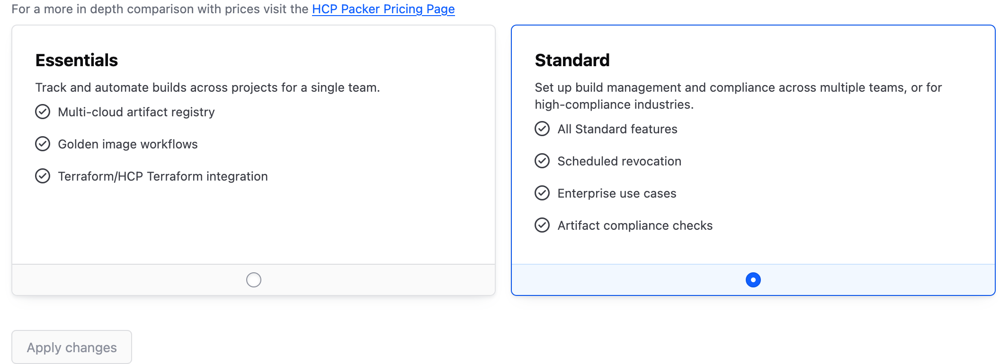

# Packer Demos

This repository contains various demos and examples for using [HashiCorp Packer](https://developer.hashicorp.com/packer).

## Prerequisites

Following are needed as of now, if anything additional is required, I'll update this section.

> *Note: SBOM demos require v1.12.0 or later.*

- Packer
- Ansible (optional, for Ansible demos)
- HCP Packer (optional, for HCP Packer demos)
- HCP Service Account with client ID and secret

## HCP Packer Tier

For SBOM generation, you will need the "Standard" tier. 



## Cloud Account

I'll lean on AWS for most of these demos, so you'll need an AWS account with appropriate permissions to create resources.

> *Note: I cannot guarantee that these will work in the free tier of AWS, so please be aware of potential costs.*

## Getting Started

1. Clone the repository:
    ```sh
    git clone https://github.com/benjamin-lykins/packer-demos.git
    cd packer-demos
    ```

2. Export Credentials: 
    ```sh
    export AWS_ACCESS_KEY_ID="your_access_key_id"
    export AWS_SECRET_ACCESS_KEY="your_secret_access_key"
    ```

    ```sh
    export HCP_CLIENT_ID="your_hcp_client_id"
    export HCP_CLIENT_SECRET="your_hcp_client_secret"
    ```

> *Note: There may be additional environment variables needed for the cloud provider, depending on your setup.*

3. Running a Demo: 

> *Note: You will need to update the `example.pkvars.hcl` file with your specific values before running the demo.*

    ```sh
    packer init ./ansible/base/.
    packer build -force -var-file=example.pkvars.hcl ./ansible/base/.
    ```
